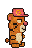

# Grind Run

An endless runner on the Abstract (Testnet) Blockchain featuring the $GRIND Token.

## Gameplay
Players collect coins in endless levels while trying to dodge obstacles and stay on screen.

## $GRIND Token integration
Players have to buy in to play the game by buying at least one character to play as. Players also have the ability to purchase Perks to make runs last longer or get more coins during a run.

All In-Game-Purchases are made in $GRIND and the money goes to a treasury. At the end of a season, every player gets awarded a portion of the whole treasury, proportional to the number of coins the player collected during that season, divided by the total number of coins collected by all players in that season.

The more you GRIND, the more you WIN!

## Incorporation of the Brands
The game features three characters:

**The Grind Hamster**

---

**Bearish Bear**

---

**Plague of Frog**

## Before you play

The Web3 and Backend Features are disabled but the core game can be played [here](https://marvindetzkeit.github.io/GRIND_Hackathon/)
